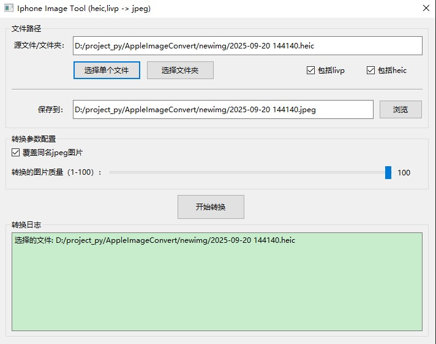

## AppleImageConvert - 苹果图片转换工具

### 说明

开发此工具的原因
- 从iphone相册下载下来的图片全是.heic及.livp，在windows系统无法查看。
- 用了第三方软件查看heic或livp非常慢。
- 预览所有照片时非常卡顿。

此工具可以解决的问题
- 批量将.heic及.livp转换为jpeg图片。
- 以100%的图片质量转换为jpeg图，效果与原图一致。

### Develop

- python 3.13
- IDE:pycharm

### Features

- 转换heic及livp图片为jpeg
- 可设置转换的jpeg图片质量(1-100)，数字越大质量越高，图片越清晰
- 转换后的jpeg图片带有原图的exif信息(GPS位置，手机型号等)
- 可整个文件夹批量转换

### Screenshots

主界面:

### Reference

**感谢以下作者的开源代码:**

- [HeicConverter](https://github.com/saschiwy/HeicConverter)

### License

`AppleImageConvert` is offered under the Apache 2.0 license.

